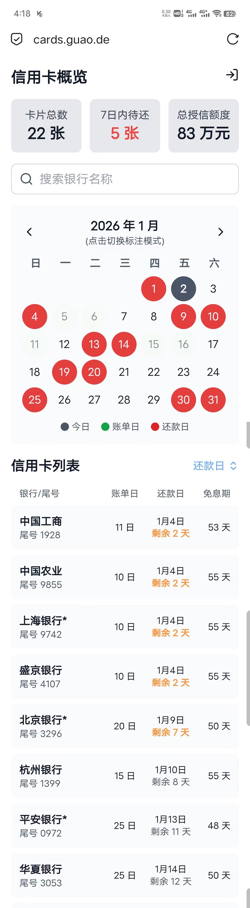

# 💳 信用卡掌柜 (MyCreditCard)

基于 Cloudflare Workers 和 D1 数据库构建的单文件无服务器信用卡管理应用。当前版本：V3.3。

## 1\. 应用简介 (Application Overview)

“信用卡掌柜”是一个轻量级、响应式的网页应用程序，专为管理用户名下多张信用卡的关键日期信息而设计。除了还款功能，可以完全替代云闪付，且因为不存储敏感信息而无安全之忧。

该应用的核心优势在于其**单文件架构**和**无服务器部署**：

  * **技术栈：** 采用 Cloudflare Workers（作为后端逻辑和前端服务）结合 D1 数据库（持久化存储）。整个应用（HTML/Tailwind CSS/JavaScript/Worker 逻辑）仅存在于一个 `worker.js` 文件中。
  * **功能目标：** 帮助用户快速查询每张卡的**账单日**、**还款日**以及**剩余免息期**等核心信息，避免错过还款日期。
  * **部署环境：** 部署在 Cloudflare Workers 上，具备极高的运行速度和可用性。

### 核心特性

  * **实时日期计算：** 自动根据当前日期、账单日、还款规则和宽限期，计算出下一个还款日和剩余免息天数。
  * **管理面板：** 提供管理员登录入口，实现卡片信息的添加、修改和删除。
  * **多模式视图：** 支持按“还款日”或“账单日”排序的列表，以及可切换标注模式的日历小控件。
  * **微信提醒：** 支持检测到存在还剩1天还款日的信用卡时，则调用PUSHPLUS的接口实现信息推送（V3.0版本新增功能）。
  * **数据导出：** 支持数据导出为excel表格，随时备份。

## 2\. 页面功能及操作方法 (Features & Usage)

应用包含四个主要视图，并通过客户端路由在单个页面内切换：

### 仪表板 (Dashboard)

这是应用的默认主界面，面向所有用户。

| 组件 | 功能描述 |
| :--- | :--- |
| **顶部统计卡** | 实时显示 **卡片总数**、**7 天内待还卡片数**（高亮提醒）和 **总授信额度**。 |
| **搜索栏** | 支持通过银行名称或卡号后 4 位进行模糊搜索。 |
| **日历小控件** | 显示当前月份的日历。<br>- **左右箭头：** 切换月份。<br>- **点击标题/标签：** 切换**标注模式**（还款日/账单日）。<br>- **标注：** 红色标记还款日，绿色标记账单日。 |
| **列表排序切换** | 位于列表标题右侧的按钮，可切换列表的排序依据：默认**按还款日由近及远**，点击后切换为**按账单日由小及大**。 |
| **信用卡列表** | 默认显示卡片信息，排版精简，优化了手机端显示效果。 |
| **添加入口** | 底部显示 `+ 添加信用卡信息` 按钮，点击后自动检测登录状态。 |

### 管理员登录 (Login)

位于页面右上角的👤图标是登录入口。

  * **登录：** 输入用户名和密码进行验证。成功后，图标旁会显示您的账号名。
  * **退出：** 登录后再次点击图标，即可安全退出，并清除临时存储的登录状态。
  * **管理卡片：** 登录成功后，仪表板中的信用卡列表行变为可点击状态，点击任一行即可进入 **卡片信息管理** 界面。

### 卡片信息管理 (Add / Manage Forms)

提供统一的表单用于输入和编辑卡片信息，包含严格的输入校验。

| 字段 | 校验规则 | 特殊交互 |
| :--- | :--- | :--- |
| **发卡银行** | 1\~10 个汉字 | - |
| **卡号后4位** | 4 位阿拉伯数字 | - |
| **卡片额度** | 1\~1,000,000 的整数 | - |
| **账单日 / 宽限期** | 1\~31 的整数 | - |
| **还款日** | 1\~31 的整数 | 包含一个切换按钮，可在 **“账单日后 X 天”** 或 **“每月固定 X 日”** 两种模式间切换。 |
| **年费** | 1\~1,000,000 的整数 | 有年费的卡片在列表中被标注* |
| **备注** | 100 字以内 | - |
| **新增界面** | 提供 `确认` 和 `取消` 按钮。 | - |
| **管理界面** | 预加载选中数据，提供 `更新` 和 `删除` 按钮。 | - |

## 3\. 在 Cloudflare 部署详细步骤 (Deployment Guide)

本应用是为 Cloudflare Workers 定制的单文件应用。请按以下步骤部署：

### 步骤 A: 创建 D1 数据库并初始化
### （注意，如果你是由2025年11月10日之前部署的1.0版本升级，请看最后特殊步骤介绍）

1.  **创建数据库：**

      * 登录 Cloudflare 仪表板，导航到 **Workers & Pages** -\> **D1**。
      * 点击 **创建数据库**，数据库名称建议使用小写字母和连字符，例如 `credit-card-db`。

2.  **创建表结构：**

      * 进入您创建的 D1 数据库，转到 **控制台 (Console)** 选项卡。
      * 粘贴以下 SQL 代码来创建 `credit_cards` 表：

```sql
CREATE TABLE IF NOT EXISTS credit_cards (
    id INTEGER PRIMARY KEY AUTOINCREMENT,
    bank_name TEXT NOT NULL,
    last_4_digits TEXT NOT NULL,
    card_limit INTEGER,
    billing_day INTEGER NOT NULL,
    payment_type TEXT NOT NULL,
    payment_value INTEGER NOT NULL,
    grace_days INTEGER DEFAULT 0,
    max_grace_period INTEGER,
    annual_fee INTEGER DEFAULT 0,
    notes TEXT
);
```

      * 点击 **执行 (Execute)**。

3.  **插入初始数据 (可选)：**

      * 等待上一步成功后，清除输入框。粘贴以下代码以预设两条卡片信息：

```sql
INSERT INTO credit_cards (bank_name, last_4_digits, card_limit, billing_day, payment_type, payment_value, grace_days, max_grace_period, annual_fee, notes)
VALUES
  ('示例银行A', '1234', 50000, 10, 'days_after_billing', 20, 3, 53, 0, '这是第一张示例卡'),
  ('示例银行B', '5678', 100000, 15, 'fixed_day', 5, 0, 35, 200, '这是第二张示例卡');
```

      * 点击 **执行 (Execute)**。

### 步骤 B: 创建 Worker 并绑定 D1

1.  **创建 Worker：**

      * 导航到 **Workers & Pages**，点击 **创建应用** -\> **创建 Worker**。
      * 在 Worker 编辑器中，将默认代码替换为上面提供的 `worker.js` **完整代码**。

2.  **绑定 D1 数据库：**

      * 在 Worker 设置页面，转到 **设置 (Settings)** -\> **变量 (Variables)** -\> **D1 数据库绑定 (D1 Database Bindings)**。
      * 点击 **编辑变量 (Edit variables)**。
      * **变量名：** 填写 `DB` (这是代码中使用的绑定变量名)。
      * **D1 数据库：** 选择您在步骤 A 中创建的数据库（例如 `credit-card-db`）。

3.  **配置环境变量：**

      * 在 **Worker 设置** -\> **变量 (Variables)** -\> **环境变量 (Environment Variables)** 下，添加以下两个变量（用于管理员登录）：
          * **变量名：** `ADMIN_USERNAME`
          * **值：** 设置您想要的管理员用户名（例如 `admin`）
          * **变量名：** `ADMIN_PASSWORD`
          * **值：** 设置您想要的管理员密码（例如 `123456`）
          * **变量名：** `PUSHPLUS_API`
          * **值：** 设置您申请的推送加账号的api，推送加的网站说明提供（例如 `https://www.pushplus.plus/send`）
          * **变量名：** `PUSHPLUS_TOKEN`
          * **值：** 设置您申请的推送加账号的token，可以是账号token或者消息token（例如 `3f2afea5235347568f9d22f1552cafbe85`）
4.  **新增触发事件（定时器）：**

      * workers项目的设置中设置触发事件，用以定义调用 Worker 的事件，类型为Cron，处理程序为scheduled()，详细信息为0 1 * * *，也就是固定每天的北京时间9:00开始检查还款日临近情况。
      * 保存。

      
5.  **保存并部署：**

      * 保存您的 Worker 代码并部署。
      * 访问您的 Worker URL 即可看到应用运行效果，最好是绑定自有域名。
      * 您也可以将您的 Worker 连接到 Git 存储库来进行自动构建和部署。

-----

<br>

项目总结：本项目包含所有信用卡管理功能、美化和交互逻辑的 **`worker.js`** 文件，您可以10分钟部署。记得修改const ADMIN_TOKEN = "secret-admin-token-12345";这一行。


 **`worker.js`** 代码特点：

1.  实现了 Cloudflare Workers 路由和 D1 数据库 CRUD 操作。
2.  在前端实现了完整的客户端路由（`dashboard`, `login`, `add`, `manage`）。
3.  优化了登录界面和表单的美观度和排版。
4.  优化了列表视图，卡片信息更紧凑，避免了在移动端换行，并将“账单日后”压缩为“账后”。
5.  日历组件支持点击标题切换标注模式，并移除了额外的注释文字。
6.  实现了还款日计算方式的切换交互和表单校验。
7.  实现了还款日临近时的微信提醒。

您可以按照 README 中的详细部署步骤，将这个单文件应用部署到您的 Cloudflare 环境中。

### 特殊步骤 
一、注意，如果你是2025年11月10日之前部署的1.0版本升级，请先：
      粘贴以下 SQL 代码来插入新列，因为数据库中新增了年费：

```sql
ALTER TABLE credit_cards ADD COLUMN annual_fee INTEGER DEFAULT 0;
```

      * 点击 **执行 (Execute)**。
> 验证。控制台输入
 ```sql
PRAGMA table_info(credit_cards);
```
>    后得到如下信息：

| cid | name              | type    | notnull | dflt_value | pk |
|-----:|-------------------|---------|:-------:|:----------:|:--:|
| 0   | id                | INTEGER |    0    | <null>     | 1  |
| 1   | bank_name         | TEXT    |    1    | <null>     | 0  |
| 2   | last_4_digits     | TEXT    |    1    | <null>     | 0  |
| 3   | card_limit        | INTEGER |    0    | <null>     | 0  |
| 4   | billing_day       | INTEGER |    1    | <null>     | 0  |
| 5   | payment_type      | TEXT    |    1    | <null>     | 0  |
| 6   | payment_value     | INTEGER |    1    | <null>     | 0  |
| 7   | grace_days        | INTEGER |    0    | 0          | 0  |
| 8   | max_grace_period  | INTEGER |    1    | <null>     | 0  |
| 9   | notes             | TEXT    |    0    | <null>     | 0  |
| 10  | annual_fee        | INTEGER |    0    | 0          | 0  |

即为正确。

截图示例：

   

二、如果你想换一种推送方式，这里推荐使用QQ邮箱推送，将QQ邮箱设置为置顶，提醒更加醒目。推送逻辑从 PushPlus 更改为您指定的 `https://mail.guao.com/send` 接口。

保留所有其他逻辑和代码结构不变，以下是修改后的 `doScheduledPush` 函数：

```javascript
async function doScheduledPush(env) {
    function escapeHtmlServer(str) {
      if (str == null) return '';
      return String(str)
        .replace(/&/g, '&amp;')
        .replace(/</g, '&lt;')
        .replace(/>/g, '&gt;')
        .replace(/"/g, '&quot;')
        .replace(/'/g, '&#039;');
    }
  
    function formatDateYMD(d) {
      const dt = d instanceof Date ? d : new Date(d);
      const y = dt.getFullYear();
      const m = String(dt.getMonth() + 1).padStart(2, '0');
      const day = String(dt.getDate()).padStart(2, '0');
      return `${y}-${m}-${day}`;
    }
  
    try {
      const { results } = await env.DB.prepare('SELECT * FROM credit_cards').all();
      const cards = results || [];
  
      const today = new Date();
      const dueSoon = [];
  
      for (const c of cards) {
        if (!c) continue;
        if (typeof c.billing_day === 'undefined' || typeof c.payment_type === 'undefined' || typeof c.payment_value === 'undefined') {
          continue;
        }
  
        const info = getCardDatesServer(c, today);
        if (info && Number(info.daysUntilPayment) === 1) {
          dueSoon.push({ card: c, info });
        }
      }
  
      if (dueSoon.length === 0) {
        console.log('[scheduled] no cards due in 1 day');
        return;
      }
  
      const listHtml = dueSoon.map(item => {
        const c = item.card;
        const deadline = item.info && item.info.nextPaymentDeadline ? new Date(item.info.nextPaymentDeadline) : null;
        const dateStr = deadline ? formatDateYMD(deadline) : '';
        const tail = c.last_4_digits ? `（${escapeHtmlServer(String(c.last_4_digits))}）` : '';
        return `<p style="margin:6px 0;font-size:14px;">${escapeHtmlServer(c.bank_name || '')}${tail}：到期日 <strong style="color:#e53e3e">${dateStr}</strong></p>`;
      }).join('');

      const contentHtml = `
        <div style="font-family: -apple-system, BlinkMacSystemFont, 'Segoe UI', Roboto, 'Helvetica Neue', Arial;">
          <h2 style="margin:0 0 8px 0;font-size:16px;">信用卡还款提醒（仅剩余 1 天）</h2>
          ${listHtml}
          <p style="margin-top:8px;color:#666;font-size:13px;">请及时还款以避免逾期费用。若已还款请忽略。</p>
        </div>
      `;

      const title = '信用卡还款提醒';

      // --- 已更改：调用您指定的邮件发送接口 ---
      // 使用 URLSearchParams 构造 GET 请求参数，对应您提供的 curl 示例
      const params = new URLSearchParams({
        fromName: "信用卡管理助手",
        to: "imsnail@qq.com", // 如果需要动态修改，请在 env 中设置或在此处修改
        subject: title,
        html: contentHtml
      });

      const apiUrl = `https://mail.guao.com/send?${params.toString()}`;

      const resp = await fetch(apiUrl, {
        method: 'GET'
      });

      const respText = await resp.text().catch(() => '');
      console.log('[scheduled] Mail API response:', resp.status, respText);
      // --- 更改结束 ---

    } catch (err) {
      console.error('[scheduled] error in doScheduledPush:', err);
    }
}

```

修改点说明：

1. 
**接口地址**：将 `pushplusApi` 替换为 `https://mail.guao.com/send` 。

2. **参数映射**：
* `token` 保持不变，对应您的 API 密钥。
* 增加了 `to` 字段，对应接收邮箱（从 `env.RECEIVER_EMAIL` 获取）。
* 将原有的 `title` 映射为 `subject`（邮件主题）。
* 将 `template: 'html'` 映射为 `type: 'html'`。

3. **其它要求**：请记得在 Cloudflare Workers 自行配置 [https://github.com/woshichenghaibo/](https://github.com/woshichenghaibo/Mail_Gateway) 以确保推送正常工作。
